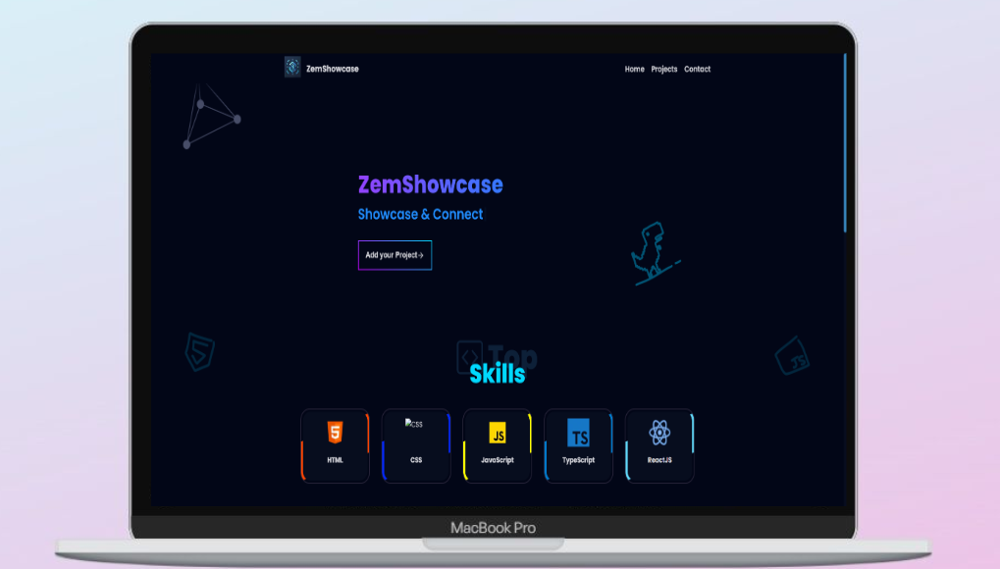

 

 

<h1 align = "center">
  ZemShowcase
</h1>

  Showcase & Connect with Developers

  

## ➕ Adding your Project:
Head over the website/add

## 🐞Bug/Issue/Feedback/Feature Request:

- If you would like to report a bug, a issue, implement any feedack, or request any feature, you are free to do so by opening a issue on this repository. Remember to give a detailed explanation of what you are trying to say, and how it will help the website. 

## 💁 Support:

For any kind of support or inforrmation, you are free to join our **Discord Server**,

<h1 align = "center">
  Thanks for Visiting🙏
</h1>

  Don't forget to leave a ⭐ 
   
  Made with 💖 by <a href = "https://github.com/Zemerik">Hemang Yadav (Zemerik)</a>

