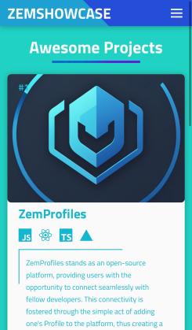

 

 

<h1 align = "center">
  ZemShowcase
</h1>

  Showcase & Connect with Developers

  

## ❗About:

ZemShowcase stands as an open-source platform, providing users with the opportunity to exhibit their projects seamlessly to fellow developers. This exhibition is fostered through the simple act of adding one's Project to the platform, thus creating a digital hub where like-minded individuals can engage, collaborate, and share insights within the expansive realm of software development. With its user-friendly interface and inclusive community ethos, ZemShowcase serves as a dynamic space where projects are highlighted, ideas are exchanged, and innovation thrives.

## ⭐ Features:

<table align = "center">
  <tr>
    <td>
       
      

        📱 Responsive UI Design supported on all devices
      

       
       
      

        📃 Showcase your own Project
      

       
       
      

        💖 Discover other Projects
      

       
       
      

        🏆 Open Source
      

    </td>
    <td>

  
    </td>
  </tr>
  <tr>
    <td>
      

       ▶️ Want to Add More Features?
      

    </td>
    <td>
      

       Open an <a href = "https://github.com/Zemerik/Zemshowcase/issues">Issue</a> and let us know! ◀
      

    </td>
  </tr>
</table>

## 🤝 Contributing:

Contributions are always welcome and appreciated! **Kindly visit the [CONTRIBUTING.md](https://github.com/Zemerik/ZemShowcase/blob/main/CONTRIBUTING.md) file for more information**

- > Don't Forget to Checkout [ZemProfiles](https://github.com/Zemerik/ZemProfiles)

## 💁 Support:

For any kind of support or inforrmation, you are free to join our **Discord Server**,

## 🥳 Contributors:

Thanks to all Contributors!

<h1 align = "center">
  Thanks for Visiting🙏
</h1>

  Don't forget to leave a ⭐
   
  Made with 💖 by <a href = "https://github.com/Zemerik">Hemang Yadav (Zemerik)</a>

